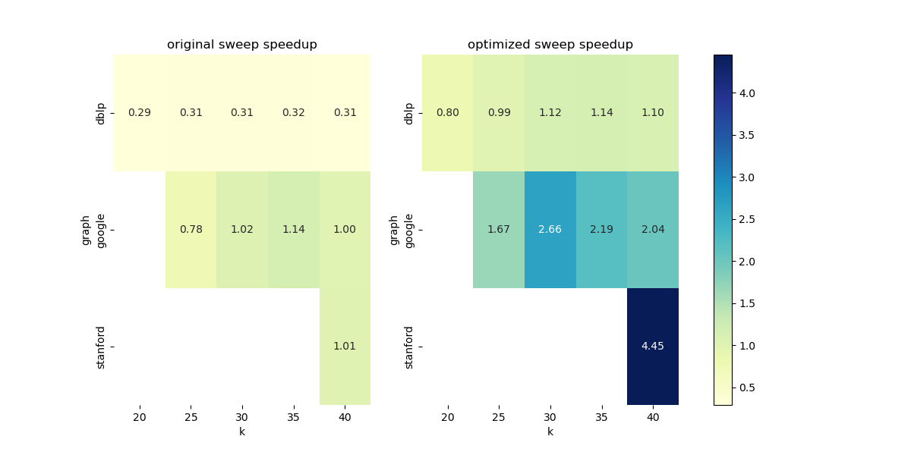

# KVCC

RUC " Algorithm and Data Structure II" Project: Enumerating k-Vertex Connected Components in Large Graphs

## Result

以下称 naive 的优化版本为 sweep1，记忆化后的优化版本为 sweep2。

|        |    | time_baseline | time_sweep1 | speedup_sweep1 | time_sweep2  |speedup_sweep2|
|--------|----|---------------|-------------|----------------|--------------|--------------|
|graph   | k  |               |             |                |              |              |
|dblp    | 20 |         1.480 |       5.072 |           0.29 |       1.860  |          0.80|
|        | 25 |         1.450 |       4.622 |           0.31 |       1.466  |          0.99|
|        | 30 |         1.460 |       4.706 |           0.31 |       1.298  |          1.12|
|        | 35 |         1.526 |       4.792 |           0.32 |       1.344  |          1.14|
|        | 40 |         1.398 |       4.544 |           0.31 |       1.270  |          1.10|
|google  | 25 |         0.778 |       1.002 |           0.78 |       0.464  |          1.68|
|        | 30 |         0.572 |       0.558 |           1.03 |       0.212  |          2.70|
|        | 35 |         0.544 |       0.480 |           1.13 |       0.246  |          2.21|
|        | 40 |         0.534 |       0.536 |           1.00 |       0.262  |          2.04|
|stanford| 40 |        58.952 |      58.310 |           1.01 |      13.238  |          4.45|

> 表格说明：以上结果都取 5 次运行的平均值，时间单位为秒。speedup 为 baseline 时间除以 sweep 时间。
> 
> 测试平台为笔记本（非服务器），CPU：AMD Ryzen 9 5900HX，内存：16G，操作系统：Ubuntu 20.04.2 LTS

