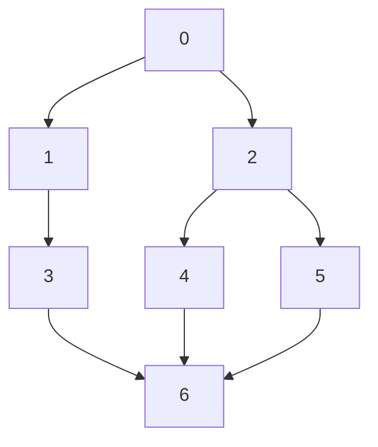

### 项目结构

```
src
|--common.hpp           # 公共定义，如边和图的数据结构
|--dinic.hpp            # dinic 算法，求一般的最大流/最小割
|--cut.hpp              # 朴素求割点集算法，包括 locol-cut 和 global-cut
|--kvcc.hpp             # kvcc 的验证算法，仅用于检查和 debug
|--local_cut.cpp        # 无向图局部最小点割，算法实现位于 cut.hpp 中
|--global_cut.cpp       # 无向图全局最小点割，算法实现位于 cut.hpp 中
|--kvcc_baseline.cpp    # k-VCC 朴素算法，算法实现位于文件内部
|--kvcc_sweep.cpp       # k-VCC 优化算法，算法实现位于文件内部
|--third-party          # 第三方库
|  |--argparse          # 命令行参数解析，方便脚本调用
|  |  |--argparse.hpp
|--Makefile             # 编译脚本
|--run.sh               # 运行脚本，测试要求数据集和数据特征
|--analyze.py           # 分析脚本，解析日志
results
|--graph_k*.txt         # k-VCC 结果
doc
|--report.md            # 实验报告
|--report.pdf           # 实验报告
```

### 测试用例

