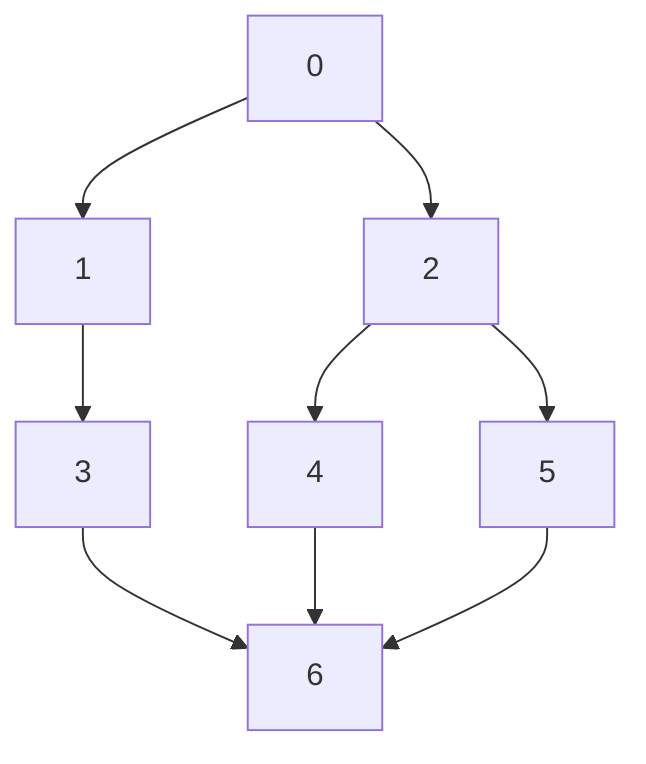
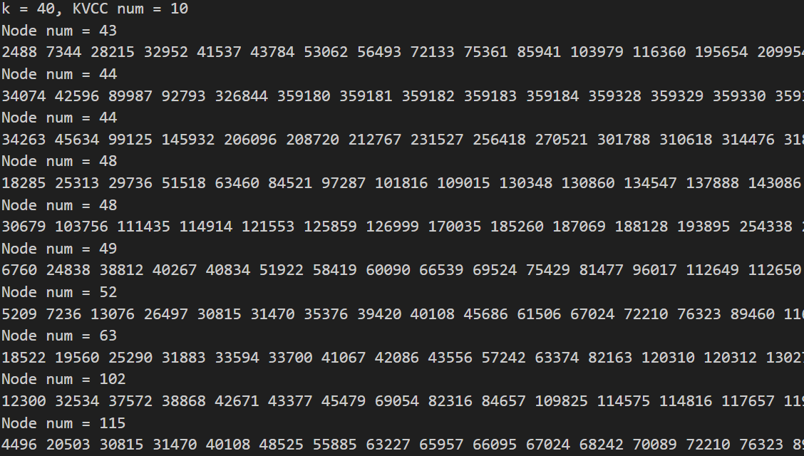
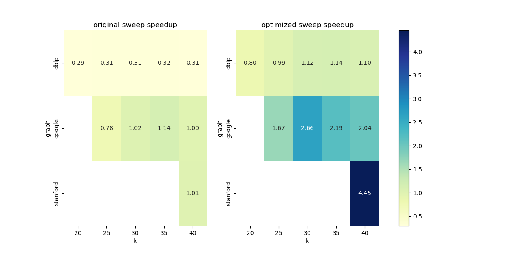

# k-VCC 报告

## 项目结构

1. 关于代码组织方式
   
   因为不同的任务之间有大量的重叠，重复编写并不是一个好的选择，比如这会导致后续对比性能的时候不一致，或者验证正确性时不一致等问题，
   所以组织文件时，我将被复用的代码放在一系列 *.hpp 中。
2. 关于第三方库
   
   引用了 argparse 库，用于编写现代化的命令行参数解析，方便之后的测试脚本调用。

### 目录结构

```
src
|--common.hpp           # 公共定义，如边和图的数据结构
|--dinic.hpp            # dinic 算法，求一般的最大流/最小割
|--cut.hpp              # 朴素求割点集算法，包括 locol-cut 和 global-cut
|--kvcc.hpp             # kvcc 的验证算法，仅用于检查和 debug
|--local_cut.cpp        # 无向图局部最小点割，算法实现位于 cut.hpp 中
|--global_cut.cpp       # 无向图全局最小点割，算法实现位于 cut.hpp 中
|--kvcc_baseline.cpp    # k-VCC 朴素算法，算法实现位于文件内部
|--kvcc_sweep.cpp       # k-VCC 优化算法，算法实现位于文件内部
|--third-party          # 第三方库
|  |--argparse          # 命令行参数解析，方便脚本调用
|  |  |--argparse.hpp
|--Makefile             # 编译脚本
|--run.sh               # 运行脚本，测试要求数据集和数据特征
|--analyze.py           # 分析脚本，解析日志
results
|--graph_k*.txt         # k-VCC 结果
doc
|--report.md            # 实验报告
|--report.pdf           # 实验报告
```

## 算法实现

### 图的存储

常见的存法有链式前向星，邻接表，邻接矩阵。

这里，链式前向星指 OI 中利用 `head` 和 `next` 的实现，邻接表指的是 `vector<vector<Edge>>` 这样的实现。

一般都采用前两者，必要时用 Hash 表间接实现邻接矩阵（比如需要快速查询两点是否有连边时）。

对于前两者，从 Cache 的角度考虑，链式前向星建图的时候比较快，因为 `Edge` 是连续拓展的，但遍历的时候比较慢，因为 `next` 是随机访问的。而邻接表则反之。

经过测试，邻接表的效果更好，所以这里采用了邻接表的实现。

值得注意的是，为此，需要每条边要多记录一个 `rev` 数据段，表示反向边的下标。

另外，所有的实现都基于 `vector`，这意味着不需要预先知道图的规模，而且可以避免大内存分配带来的小规模图上运行时间不准确的问题。

### Task1: 无向图局部最小点割

割点法：将点 $i$ 拆为入点 $i$ 和出点 $i+n$，原图的边 $u \to v$ 变为 $u+n \to v$。除源点和汇点外，其他点的入点和出点之间连容量为 $1$ 的边，除此之外所有的新边的容量为 $\infty$。

至此，要求最小点割，只要求最小边割即可。这可以用最大流算法求解。

具体地，这里采用了当前弧优化的 Dinic 算法。

最后求具体的割边（割点）时，先从源点出发，遍历非满流的边得到 S 连通块。然后枚举每条拆点边的两侧，
如果两侧属于不同的连通块，则该边为割边，对应的点为割点。

#### 代码

加边

```cpp
void addEdge(int from, int to, int capacity = 0, int rev = 0) {
    edges[from].emplace_back(from, to, capacity, rev);
}
void addFlowEdge(int from, int to, int capacity) {
    addEdge(from, to, capacity, edges[to].size());
    addEdge(to, from, 0, edges[from].size() - 1);
}
```

当前弧优化 Dinic

```cpp
int bfs() {
    fill(cur.begin(), cur.end(), 0);
    // .....
    while (!q.empty()) {
        int u = q.front();
        q.pop();
        for (auto& e : graph.edges[u]) {
            if (e.flow < e.capacity && !depth[e.to]) {
                depth[e.to] = depth[u] + 1;
                q.push(e.to);
            }
        }
    }
    // .....
}
int dfs(int u, int flow_in) {
    if (u == sink || flow_in == 0)
        return flow_in;
    int flow_out = 0;
    for (int& i = cur[u]; i < (int)graph.edges[u].size(); i++) {
        auto& e = graph.edges[u][i];
        // .....
    }
    return flow_out;
}
```

建图

```cpp
for (int u = 0; u < n; u++) {
    if (u != source && u != sink) {
        g.addFlowEdge(u, u + n, 1);
    } else {
        g.addFlowEdge(u, u + n, INF);
    }
}
for (auto& es : graph.edges) {
    for (auto& e : es) {
        g.addFlowEdge(e.from + n, e.to, INF);
    }
}
```

### Task2: 无向图全局最小点割

算法没有什么特别之处，按照伪代码实现即可。

实现上，我主要琢磨了有关拷贝和内存分配的优化：

1. 尽量使用引用
2. 用 static 变量代替局部变量，比如 `localCut` 每次都要重新建图，内存完全释放再分配就会带来额外的开销，
   直接 `resize` 可以稍微提升一点性能

```cpp
// 寻找小于等于k的全局割
tuple<vector<int>, int, int> calGlobalCut(Graph& graph, int k = INF) {
    int source = graph.minDegVertex();
    // case1: 如果有直接的割
    for (int sink = 0; sink < graph.n; sink++) {
        if (sink != source) {
            auto cut = calLocolCut(graph, source, sink, k);
            if (!cut.empty()) {
                return make_tuple(cut, source, sink);
            }
        }
    }
    // case2: 两两邻居
    for (int i = 0; i < (int)graph.edges[source].size(); i++) {
        auto& e1 = graph.edges[source][i];
        int v1 = e1.to;
        for (int j = i + 1; j < (int)graph.edges[source].size(); j++) {
            auto& e2 = graph.edges[source][j];
            int v2 = e2.to;
            auto cut = calLocolCut(graph, v1, v2, k);
            if (!cut.empty()) {
                return make_tuple(cut, v1, v2);
            }
        }
    }
    return make_tuple(vector<int>(), -1, -1);
}
```

> Task1,2 的内容请见 `common.hpp`, `dinic.hpp`, `cut.hpp`，而 `local_cut.cpp`, `global_cut.cpp` 
> 其实只是对以上内容的调用。

### Task3: 朴素 k-VCC

因为图的编号不连续，所以先做了一遍离散化。这一步需要一定的时间，在实际问题中，这一步往往是必须的，可以视作原始数据处理的一部分，在应用场景下，这一预处理可以被各种算法使用，所以均摊下来这一步的耗时不需要考虑，所以最后统计算法运行时间时，不计入这一步。

> 离散化耗时说明：对于朴素算法，用时占 20% 左右。

使用递归分治的方法

1. 首先用类似拓扑排序的办法求 `k-Core` ，不断加入度小于 $k$ 的点，直到队列清空。
2. BFS 原图，得到连通块，记作 `subGraph`，重新编号，重新连边。
3. 对每一个连通块 `subGraph` ，求其全局点割，如果为空，加入 `result`，否则做 `partition`，得到 `subSubGraph`
4. 对 `subSubGraph` 递归调用以上过程。

#### 1

求 k-Core 比较简单，唯一特别的是我的实现中判断加入的条件是 `deg[u] == k-1`，这样能保证第一次小于 $k$ 时被加入，同时节约一个标记数组的开销。

#### 2

求连通分支。

最外层遍历每个点，如果没有被访问过，就 BFS，得到一个连通块，然后重新编号，重新连边。

BFS 的过程中记录原边，同时维护一些必要信息，比如更新点的新编号 `id[u] = ++vetexCnt` 等。

使用 BFS 相比于 DFS 往往性能好得多，因为节省了递归压栈的开销。但代码比较长。

#### 3

求 `overlap-partition`。

相比于 2，这里的不同之处是割点属于每一个新分支

一种朴素的做法是每轮外层循环（`BFS` 每个分支前）都重置一遍 `vis` 数组，当连通分支很多的时候（极端情况下，实际很少发生），复杂度很高，这里我采用更精细的方法：

1. 在最外层之前，先求割点的生成子图（即先找出两端都是割点的边），复杂度是 $O(|\text{cut}|\deg_G)$
2. 给割点固定标号：$0$ 到 $|\text{cut}|-1$，之后每次 `BFS` 从 $|\text{cut}|$ 开始标号
3. 每次 `BFS` 必须从非割点开始，遇到割点时记录边，但不加入队列，如此，我们会得到这个分支：割点 $\leftrightarrow$ 非割点 $\cup$ 割点 之间的边。另外，判断是否是割点利用 `unordered_set`，复杂度是 $O(1)$
4. 结合 1 和 3 中得到的边，构建 `subSubGraph`

> 朴素做法的最差复杂度是 $O(n^2 + m)$，而精细做法的最差复杂度是 $O(n + m)$


结合以上 4 步，就可以得到 `k-VCC` 的结果。

### Task4: k-VCC 的优化算法

#### 文档里的 bug

首先指出一个实验文档里的漏洞：

> 只有同时满足以下两点的点 $v$ 才可能是 $G_i$ 的 strong-side-vertex:
> 1. $v$ 是 $G$ 的 strong-side-vertex
> 2. $N(v) \cap S \neq \emptyset$

正确的表述是：

1. $v$ 是 $G$ 的 strong-side-vertex
2. $N(v) \cap S \neq \emptyset$
3. $N(v) \cap S = \emptyset$

根据论文原文，其中 1 是 $v$ 是 $G_i$ 的 rong-side-vertex 的必要条件，3 是充分条件。

所以应该说：

我们只需要用定义验证满足 1 的点 $u$，但是在这之前，我们可以先用一个容易计算的条件 3 来直接断定某些点一定是 strong-side-vertex。而不满足 3 的只，即满足 1 和 2 的只能而且必须用定义验证。

#### 算法设计

为了更快地找到全局割，一种感性的想法是，源点和汇点距离越远越容易找到，所以在
遍历汇点的时候，可以按照距离降序遍历，这点已经在论文中有所体现。

值得注意的是，这是一张无权图，或者说边的距离都为 1，所以只需要最简单的 BFS 就可以求出距离，不需要采用最短路算法，比如 Dijkstra, SPFA 等。

#### 文档之外的优化

文档并没有对判断 isStrongSideVertex 的算法进行说明，我的实现里进行了如下几点优化：

1. 记忆化 $N(v_1) \cap N(v_2)$ 的大小，用 `unordered_map` 实现，如若不然，复杂度是 $O(n^3)$，而记忆化之后，复杂度是 $O(n^2)$，因为每对点的交只需要计算一次。测试表明，这一优化是必须的，没有这一优化甚至会算法导致更慢。
2. 启发式地访问邻居节点对，按 $|N(v_1)| + |N(v_2)|$ 增序遍历：因为只要有一对不满足条件，就可以宣布其不是 strong-side-vertex，感性来看，$|N(v_1)| + |N(v_2)|$ 越小的点，其交越可能小于 $k$，这样可以提前剪枝。

```cpp
bool isStrongSideVertex(Graph& graph, int k, int u) {
    auto n = neighbor(graph, u);
    int cnt = 0;
    sort(n.begin(), n.end(), [&](int i, int j) { return graph.edges[i].size() < graph.edges[j].size(); });
    // 按照 N(neighbor) 的大小排序，从小的组合开始尝试，更容易提前找到不够大的交，提前剪枝
    for (int k = 1; k < 2 * (int)n.size() - 2; k++) {
        for (int i = max(k - (int)n.size() + 1, 0); i < (int)n.size() && 2 * i < k; i++) {
            int j = k - i;
            int v1 = n[i];
            int v2 = n[j];
            cnt++;
            int size = 0;
            if (Sweep::intersectionSize.find(make_pair(v1, v2)) != Sweep::intersectionSize.end()) {
                size = Sweep::intersectionSize[make_pair(v1, v2)];
            } else {
                unordered_set<int> n12Intersection;
                for (auto& e : graph.edges[v1]) {
                    n12Intersection.insert(e.to);
                }
                for (auto& e : graph.edges[v2]) {
                    if (n12Intersection.find(e.to) != n12Intersection.end()) {
                        size++;
                    }
                }
                Sweep::intersectionSize[make_pair(v1, v2)] = size;
            }
            if (graph.edgeSet.find(make_pair(v1, v2)) == graph.edgeSet.end() && size < k) {
                return false;
            }
        }
    }
    return true;
}
```

`overlap partition` 生成的子图的 `strong-side-vertex` 计算

以下是更正文档中 bug 后的正确写法：

```
Sweep::intersectionSize.clear();
for (auto u : subGraphVertex) {
    bool hasCutNeighbor = false;
    if (graph.strongSideVertex.find(u) != graph.strongSideVertex.end()) {
        for (auto& e : graph.edges[u]) {
            int v = e.to;                          // neighbors
            if (cutSet.find(v) != cutSet.end()) {  // 割点
                hasCutNeighbor = true;
                break;
            }
        }
        if (!hasCutNeighbor) {  // 满足强条件（充分条件），直接加入
            subSubGraph.strongSideVertex.insert(id[u]);
        } else {
            if (isStrongSideVertex(subSubGraph, k, id[u])) {  // 否则检查充要条件
                subSubGraph.strongSideVertex.insert(id[u]);
            }
        }
    }
}
```

## 实验结果

### Task1,2

测试用例为



测试结果为

```
./local_cut 
input time=0.000500901
local_cut time=3.4896e-05
cut size: 2
1
2
```

```
./global_cut 
input time=5.3582e-05
global_cut time=1.7123e-05
source: 0
sink: 3
cut size: 2
1
2
```

### Task3,4

#### 正确性方面

推荐参数的结果实验文档中的比对，完全一致。

以 dblp, k=40 为例：



> 另外，唯一输出的一致性，当 kvcc 大小相同时，按照其中最小编号的编号排序。

#### 性能方面

以下称没有记忆点对邻居交的大小的 sweep 版本为 sweep1，有记忆化的为 sweep2。

```
             time_baseline  time_sweep1  speedup_sweep1  time_sweep2  speedup_sweep2
graph    k                                                                          
dblp     20          1.480        5.072            0.29        1.860            0.80
         25          1.450        4.622            0.31        1.466            0.99
         30          1.460        4.706            0.31        1.298            1.12
         35          1.526        4.792            0.32        1.344            1.14
         40          1.398        4.544            0.31        1.270            1.10
google   25          0.778        1.002            0.78        0.464            1.68
         30          0.572        0.558            1.03        0.212            2.70
         35          0.544        0.480            1.13        0.246            2.21
         40          0.534        0.536            1.00        0.262            2.04
stanford 40         58.952       58.310            1.01       13.238            4.45
```

> 表格说明：以上结果都取 5 次运行的平均值，时间单位为秒。
> 
> 测试平台为笔记本（非服务器），CPU：AMD Ryzen 9 5900HX，内存：16G，操作系统：Ubuntu 20.04.2 LTS



可以看出，sweep1 的效果反而变差了。

对于 sweep2 来说，尤其是当原本运行时间长，即可以猜测是搜索空间很大时，
减少了搜索空间，能够取得较好的效果。而原本运行时间就比较短的，优化效果就不会很明显。

#### 进一步分析

对于 K-Core 来说，图比较密集，使用邻接矩阵存储也许可以最终取得更好的效果。但目前的运行效率已经比较高了。